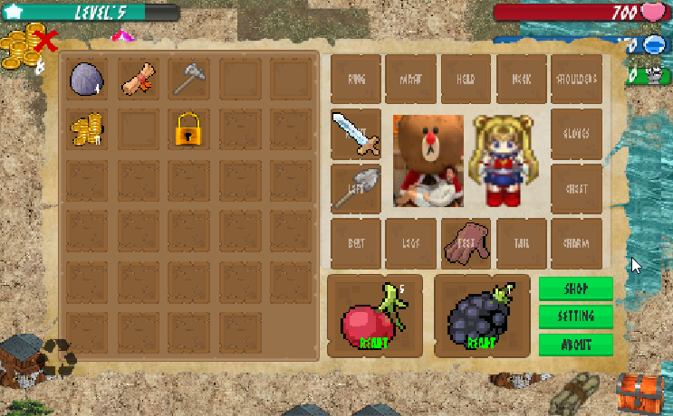

# Once Upon a Player (OUP)

##Terrain 

##Inventory

 

##Monsters Characters

For more style Guidance check [Here](https://help.github.com/articles/basic-writing-and-formatting-syntax/#quoting-code).

