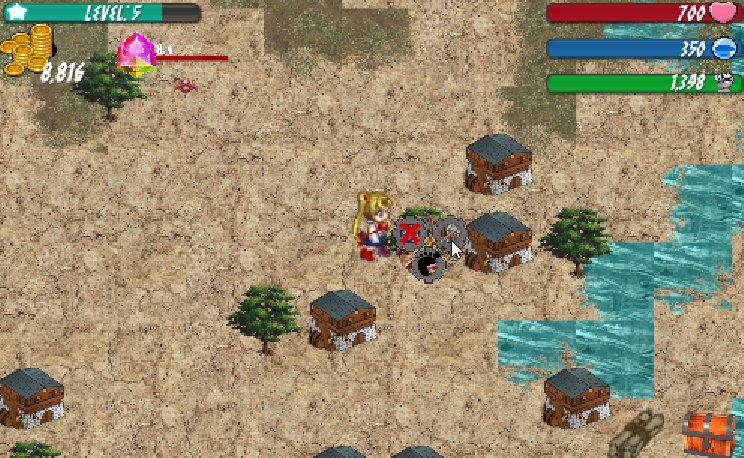
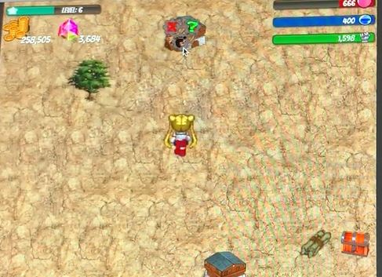
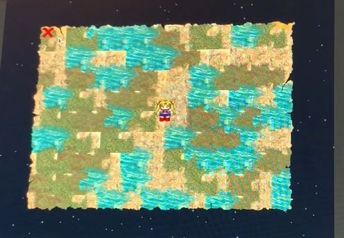
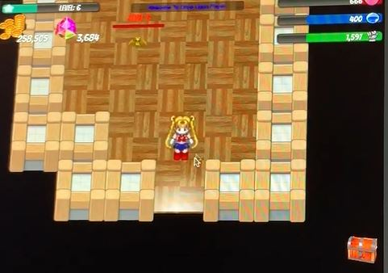
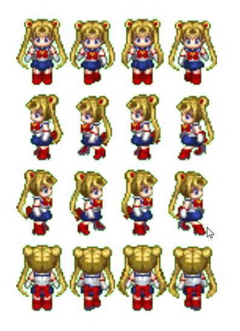
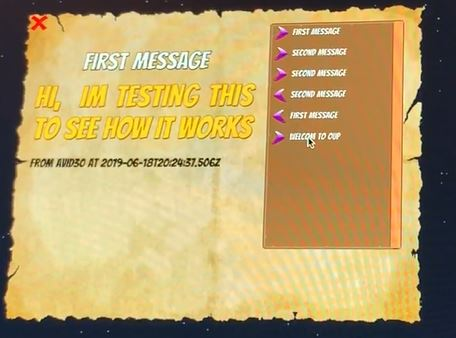
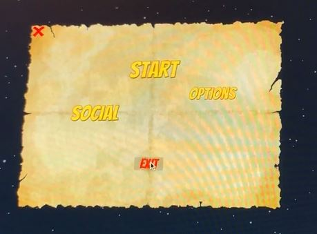
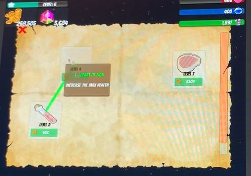
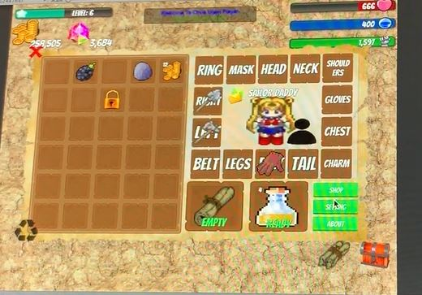
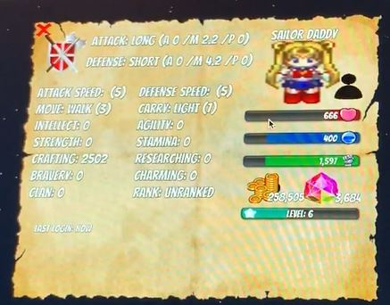

# Once Upon a Player (OUP)
 
This was my first game designed in Unity between 2018-2019

## Technologies/Languages

* Unity 
* C# scripting 
* AWS Lambda function (JS)
* DynamoDB

## Highlights
 
 
* Infinite Map (Based on GPS location) 
	 
	* Structures (Rooms, Consumables)
	* Terrains (Walkable, Flyable , ...) 
	* Monsters
	* Mini Map 
	 

 
* Rooms Generator  (Based on GPS location) 
	* Tiles
	* Walls
	* Monsters 
	* Consumables

 	
* Monsters
	* Character
	* Movement
	* Attack
	* Interactions
	* Capture able

* Player	
	* Stats 
	 
	* Profile
	* Movement
	* Character 
	* Attack
	* Inventory
	* Research
	* Messaging 
	 
	* Capture Monsters
	
 
* Menus
	* Sound
	* Social Media ( FB, G)
	
 
* Inventory Management 
	* Mixing (based on found Recipes) 
	 
	* Researches 
	 
	* Stacking
	* Consuming 
	 
	* Equipments 
	* Stats
	 

## GamePlay

You can access the videos Here 
 
